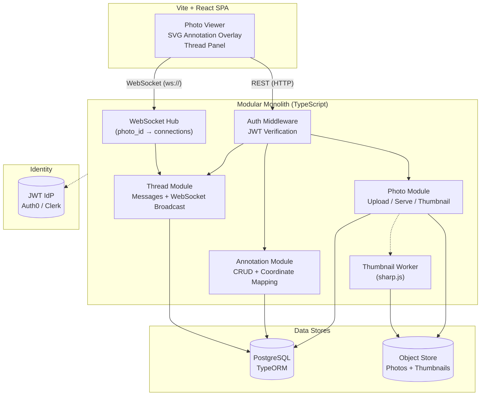
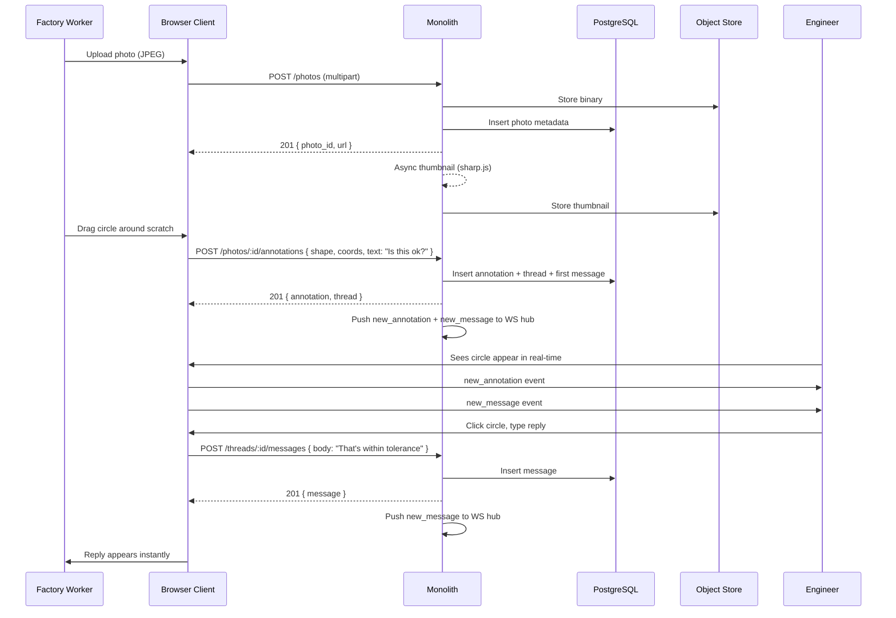
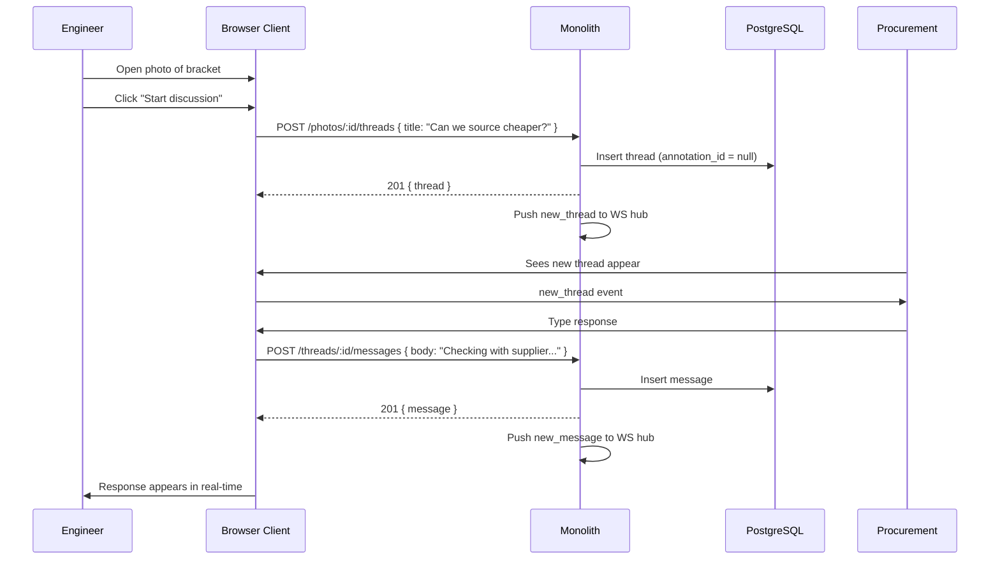
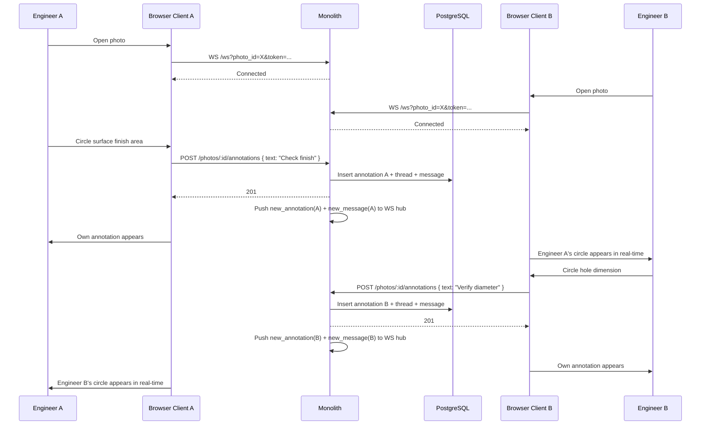

```mermaid
graph TB
    subgraph Client["Vite + React SPA"]
        UI["Photo Viewer<br/>SVG Annotation Overlay<br/>Thread Panel"]
    end

    subgraph Monolith["Modular Monolith (TypeScript)"]
        direction TB
        Auth["Auth Middleware<br/>JWT Verification"]
        PhotoMod["Photo Module<br/>Upload / Serve / Thumbnail"]
        AnnMod["Annotation Module<br/>CRUD + Coordinate Mapping"]
        ThreadMod["Thread Module<br/>Messages + WebSocket Broadcast"]
        WS["WebSocket Hub<br/>(photo_id → connections)"]
        Thumb["Thumbnail Worker<br/>(sharp.js)"]
    end

    subgraph Storage["Data Stores"]
        PG[("PostgreSQL<br/>TypeORM")]
        OS[("Object Store<br/>Photos + Thumbnails")]
    end

    subgraph AuthExternal["Identity"]
        IdP[("JWT IdP<br/>Auth0 / Clerk")]
    end

    UI -- REST (HTTP) --> Auth
    UI -- WebSocket (ws://) --> WS
    Auth --> PhotoMod
    Auth --> AnnMod
    Auth --> ThreadMod
    PhotoMod --> OS
    PhotoMod --> PG
    AnnMod --> PG
    ThreadMod --> PG
    PhotoMod -.-> Thumb
    Thumb --> OS
    WS --> ThreadMod
    Monolith -.-> IdP
```

## Scenario 1: Scratch on a part (happy path)

```mermaid
sequenceDiagram
    participant FW as Factory Worker
    participant Client as Browser Client
    participant Monolith
    participant PG as PostgreSQL
    participant OS as Object Store
    participant Eng as Engineer

    FW->>Client: Upload photo (JPEG)
    Client->>Monolith: POST /photos (multipart)
    Monolith->>OS: Store binary
    Monolith->>PG: Insert photo metadata
    Monolith-->>Client: 201 { photo_id, url }
    Monolith-->>Monolith: Async thumbnail (sharp.js)
    Monolith->>OS: Store thumbnail

    FW->>Client: Drag circle around scratch
    Client->>Monolith: POST /photos/:id/annotations { shape, coords, text: "Is this ok?" }
    Monolith->>PG: Insert annotation + thread + first message
    Monolith-->>Client: 201 { annotation, thread }
    Monolith->>Monolith: Push new_annotation + new_message to WS hub

    Eng->>Client: Sees circle appear in real-time
    Client->>Eng: new_annotation event
    Client->>Eng: new_message event

    Eng->>Client: Click circle, type reply
    Client->>Monolith: POST /threads/:id/messages { body: "That's within tolerance" }
    Monolith->>PG: Insert message
    Monolith-->>Client: 201 { message }
    Monolith->>Monolith: Push new_message to WS hub

    Client->>FW: Reply appears instantly
```

## Scenario 2: Photo-level discussion (no annotation)

```mermaid
sequenceDiagram
    participant Eng as Engineer
    participant Client as Browser Client
    participant Monolith
    participant PG as PostgreSQL
    participant Proc as Procurement

    Eng->>Client: Open photo of bracket
    Eng->>Client: Click "Start discussion"
    Client->>Monolith: POST /photos/:id/threads { title: "Can we source cheaper?" }
    Monolith->>PG: Insert thread (annotation_id = null)
    Monolith-->>Client: 201 { thread }
    Monolith->>Monolith: Push new_thread to WS hub

    Proc->>Client: Sees new thread appear
    Client->>Proc: new_thread event

    Proc->>Client: Type response
    Client->>Monolith: POST /threads/:id/messages { body: "Checking with supplier..." }
    Monolith->>PG: Insert message
    Monolith-->>Client: 201 { message }
    Monolith->>Monolith: Push new_message to WS hub

    Client->>Eng: Response appears in real-time
```

## Scenario 3: Concurrent annotations

```mermaid
sequenceDiagram
    participant EngA as Engineer A
    participant ClientA as Browser Client A
    participant Monolith
    participant PG as PostgreSQL
    participant ClientB as Browser Client B
    participant EngB as Engineer B

    EngA->>ClientA: Open photo
    ClientA->>Monolith: WS /ws?photo_id=X&token=...
    Monolith-->>ClientA: Connected
    EngB->>ClientB: Open photo
    ClientB->>Monolith: WS /ws?photo_id=X&token=...
    Monolith-->>ClientB: Connected

    EngA->>ClientA: Circle surface finish area
    ClientA->>Monolith: POST /photos/:id/annotations { text: "Check finish" }
    Monolith->>PG: Insert annotation A + thread + message
    Monolith-->>ClientA: 201
    Monolith->>Monolith: Push new_annotation(A) + new_message(A) to WS hub
    ClientA->>EngA: Own annotation appears
    ClientB->>EngB: Engineer A's circle appears in real-time

    EngB->>ClientB: Circle hole dimension
    ClientB->>Monolith: POST /photos/:id/annotations { text: "Verify diameter" }
    Monolith->>PG: Insert annotation B + thread + message
    Monolith-->>ClientB: 201
    Monolith->>Monolith: Push new_annotation(B) + new_message(B) to WS hub
    ClientB->>EngB: Own annotation appears
    ClientA->>EngA: Engineer B's circle appears in real-time
```
