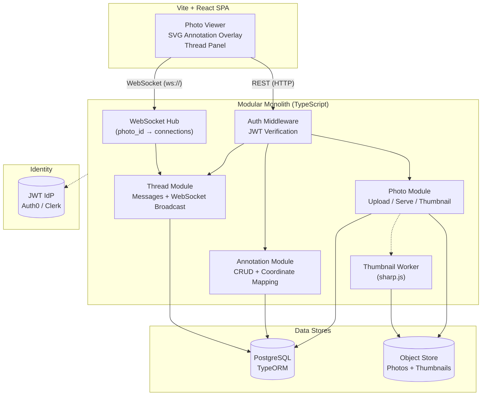

```mermaid
graph TB
    subgraph Client["Vite + React SPA"]
        UI["Photo Viewer<br/>SVG Annotation Overlay<br/>Thread Panel"]
    end

    subgraph Monolith["Modular Monolith (TypeScript)"]
        direction TB
        Auth["Auth Middleware<br/>JWT Verification"]
        PhotoMod["Photo Module<br/>Upload / Serve / Thumbnail"]
        AnnMod["Annotation Module<br/>CRUD + Coordinate Mapping"]
        ThreadMod["Thread Module<br/>Messages + WebSocket Broadcast"]
        WS["WebSocket Hub<br/>(photo_id → connections)"]
        Thumb["Thumbnail Worker<br/>(sharp.js)"]
    end

    subgraph Storage["Data Stores"]
        PG[("PostgreSQL<br/>TypeORM")]
        OS[("Object Store<br/>Photos + Thumbnails")]
    end

    subgraph AuthExternal["Identity"]
        IdP[("JWT IdP<br/>Auth0 / Clerk")]
    end

    UI -- REST (HTTP) --> Auth
    UI -- WebSocket (ws://) --> WS
    Auth --> PhotoMod
    Auth --> AnnMod
    Auth --> ThreadMod
    PhotoMod --> OS
    PhotoMod --> PG
    AnnMod --> PG
    ThreadMod --> PG
    PhotoMod -.-> Thumb
    Thumb --> OS
    WS --> ThreadMod
    Monolith -.-> IdP
```
