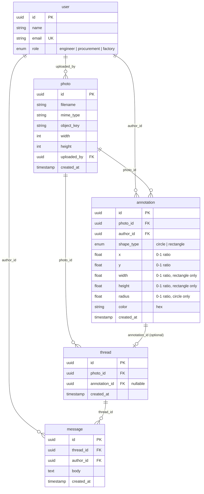

# Entity-Relationship Diagram

## Relationship Summary

| Entity A | Relationship | Entity B | Cardinality | Via |
|---|---|---|---|---|
| `user` | uploads | `photo` | one-to-many | `photo.uploaded_by` |
| `user` | authors | `annotation` | one-to-many | `annotation.author_id` |
| `user` | authors | `message` | one-to-many | `message.author_id` |
| `photo` | contains | `annotation` | one-to-many | `annotation.photo_id` |
| `photo` | has | `thread` | one-to-many | `thread.photo_id` |
| `annotation` | spawns | `thread` | one-to-zero-or-one | `thread.annotation_id` (nullable) |
| `thread` | contains | `message` | one-to-many | `message.thread_id` |

## Key design notes

- **Coordinates as ratios (0–1)**: `x`, `y`, `width`, `height`, `radius` are fractions of image dimensions so annotations survive responsive/retina layouts
- **Annotation → Thread is optional 1:1**: an annotation always spawns a thread (with the annotation text as the first message body), but a thread can exist without an annotation (photo-level discussion)
- **Cascade deletes**: deleting a photo cascades to its annotations, threads (annotation-level + photo-level), and messages via foreign keys
