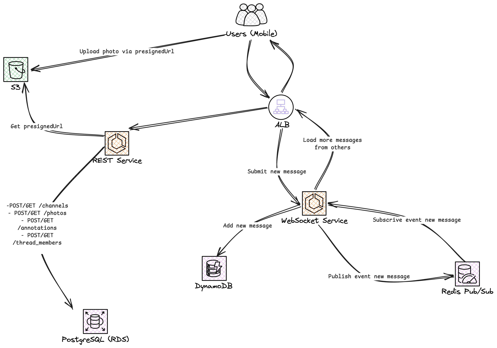
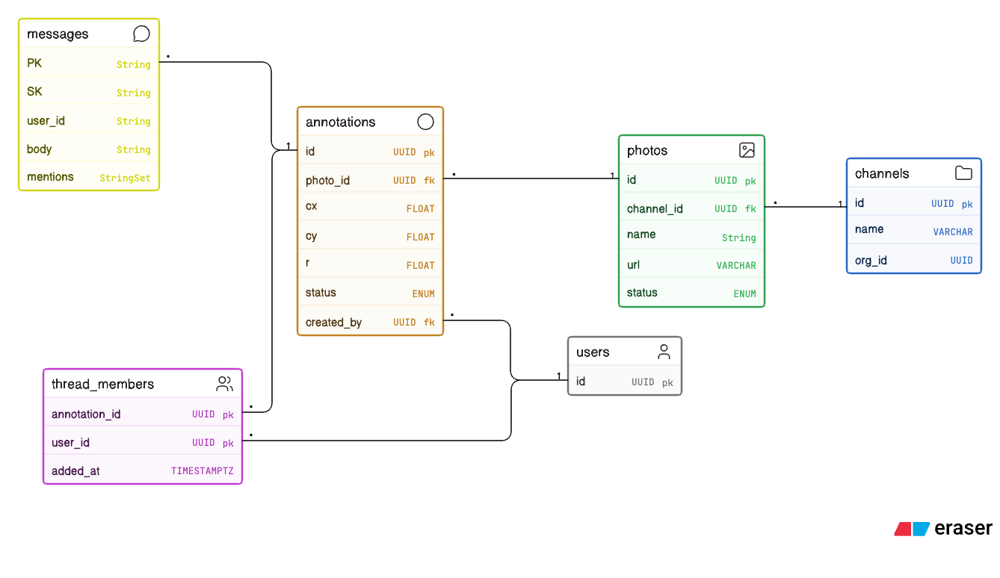
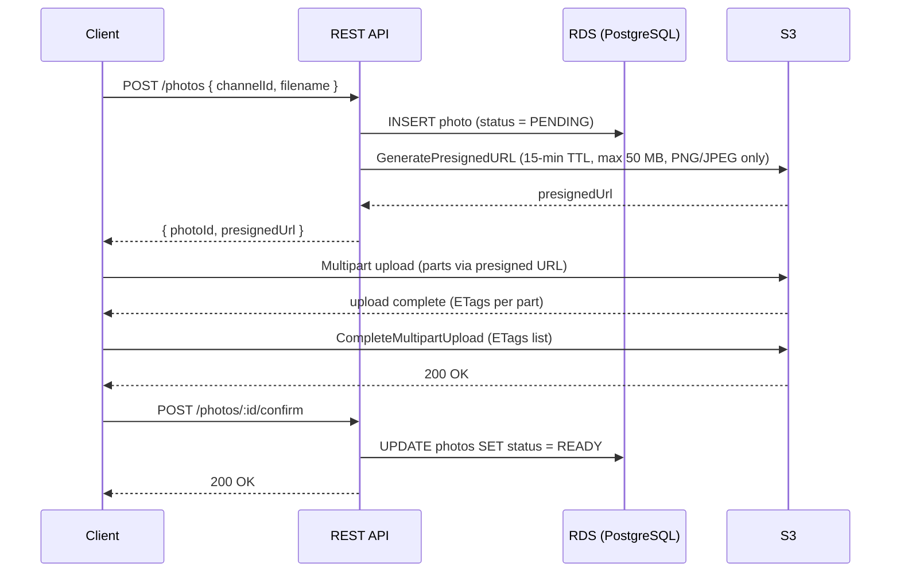
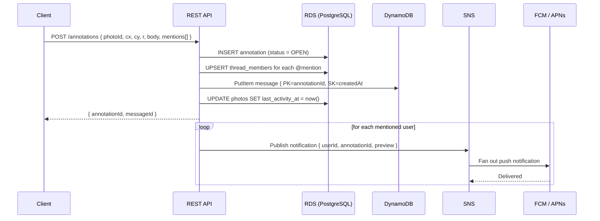
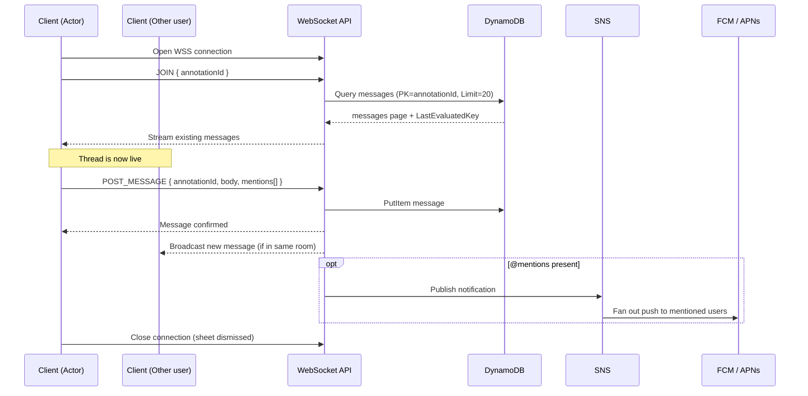
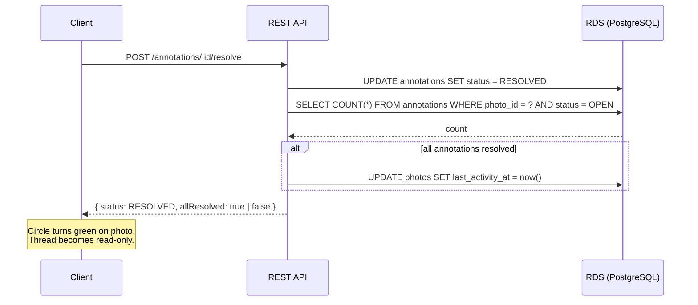

# CADDi Photo Annotation Service — Design Document

---

## 1. Overview & Assumptions

A mobile-only B2B service enabling factory workers and engineers at large manufacturing companies (500+ employees) to communicate around photos: upload, annotate with circles, and discuss in threaded comments. The system must ship quickly to prove viability.

**Functional Requirements**
- S3 upload policy enforces MIME type (`image/png`, `image/jpeg`) and max size (50 MB)
- Channel-scoped photo gallery
- Photo upload via S3 presigned URL (PNG/JPEG, max 50 MB)
- Circle annotations with threaded comments
- Push notifications via @mention
- Resolve annotation (closes thread)

### Non-Functional Requirements
#### Security
- JWT validation on every REST and WebSocket request
- S3 bucket is private; access only via presigned URLs (15-minute TTL for uploads, 60-minute for reads)
- Fine-grant permissions (RBAC, ABAC,...)

#### Performance
- Gallery query indexed on `channel_id + last_activity_at DESC`
- Thread load: DynamoDB cursor pagination, 20 messages per page
- Photo delivery via CDN (Cloudfront/Cloudflare) in front of S3
- WebSocket service scales independently from REST API

#### DevOps
- CI/CD: lint → unit test → Docker build → ECR → ECS rolling deploy
- Separate environments: dev/staging/production
- DB migrations run automatically on deploy
- Secrets injected as environment variables from AWS Secrets Manager

#### Monitoring
- CloudWatch Logs for REST and WebSocket services
- Custom metrics: upload success rate, WS active connection count, message post latency, ...
- CloudWatch Alarms → SNS → Slack for p99 latency spikes and 5xx error rate

### Key Assumptions
- Mobile clients (iOS/Android React Native) compress photos client-side before upload
- Annotations mechanism: store circle coordinate → Canvas/SVG overlay on top of the photo separately (don't need rewrite the photo)
- Traffic for areas: Upload/Fetch photos, Draw/Load annotations → Read > Write → Use SQL to leverage its relational nature, index optimized for read
- Traffic for message per thread: High write → Use NoSQL (DynamoDB) to leverage its nature of high availability/ scale write, acceptable eventually consistency  
- Users are pre-authenticated; JWT passed in every request header
- Channels, orgs, and user accounts already exist in a pre-existing auth system
- CADDi runs on GCP, this document use AWS services (base on my experience), but still have similar one in GCP

---

## 2. Architecture Diagram

---

## 3. Technical Stack

| Layer | Technology |
|---|---|
| Mobile Client | React Native (iOS + Android) |
| Annotation UI | Canvas/SVG overlay on photo |
| REST API | Node.js, TypeORM |
| WebSocket API | Node.js + `ws` library |
| Relational DB | RDS PostgreSQL (managed) |
| Document Store | DynamoDB (messages, high-write) |
| File Storage | S3 + CDN |
| Push Notifications | SNS |
| Container Infra | ECS Fargate + ECR |
| CI/CD | GitHub Actions → ECR → ECS rolling deploy |
| Secrets | AWS Secrets Manager |

---

## 4. Data Models

### 4a. RDS PostgreSQL

Relational data with moderate write traffic. Used as the single source of truth for structure and membership — avoiding dual-write complexity.

- **channels**

- **photos**

- **annotations** (equivalent to 1 thread) : Store the coordinates variables to identify the annotation circle

- **thread_members**: Link members that has been tagged in a thread

### 4b. DynamoDB

- High availability → High-write traffic when engineers reply each other on a hot thread. 
- Eventually consistent but slightly latency → acceptable when message from other engineer arrive late 1~3s is ok
- Leverage cursor-base pagination to "Load more" when scroll down messages

- **messages**

| Attribute | Type | Notes |
|---|---|---|
| PK | String | `annotation_id` |
| SK | String | `created_at#message_id` (composite, ensures uniqueness + order) |
| user_id | String | |
| body | String | max 400 KB per item |
| mentions | StringSet | user IDs tagged with @mention |

**Access patterns**
- **Load thread:** `Query PK=annotation_id`, `Limit=20`, paginate via `LastEvaluatedKey`
- **Post message:** `PutItem` with PK + composite SK
- **Notification fan-out:** REST API reads `thread_members` from RDS — no GSI needed

---

## 5. Key Flows

### Photo Upload (Presigned URL)

> **Tech debt:** PENDING photos that are never confirmed stay invisible to other users (gallery filters `WHERE status = 'READY'`), but remain in S3/RDS indefinitely. A nightly cleanup job is deferred.

### Add Annotation + First Message

### Real-time Thread (WebSocket)

### Resolve Annotation

---

## 6. Trade-offs & Tech Debt

| Decision | Rationale | Tech Debt |
|---|---|---|
| RDS as single source of truth for channels, photos, annotations & thread_members | Relational data, Read > Write, don't need to scale for high Write traffic, just optimize index for Read is enough| — |
| DynamoDB for `messages` only | High-write, cursor-paginated for "load more" behaviour, eventually consistent. No joins needed. | — |
| WebSocket | Required for near real-time data message from server → client | Consider alternatively by SSE to reduce overhead of server resources |

| Protocol for message update | Pros | Cons |
|---|---|---|
| REST (Polling) | Cheap (don't hold long-live connection) | The latency is high, less reactive, depends on the time window defined betwwen each requests |
| SSE | Cheap (normal GET HTTP request but long-live) | May cause setup overhead, not too popular.  |
| WebSocket | After `Upgrade Protocol`, the data payload is small (not include headers). Bidirectional data transfer | Expensive. Infras/Server resource (CPU, memory) overhead because of long-live connections cause socket exhaustion, ping/pong mechanism. Client must reconnect when back from offline |
---
