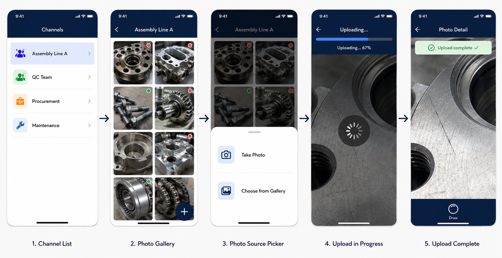
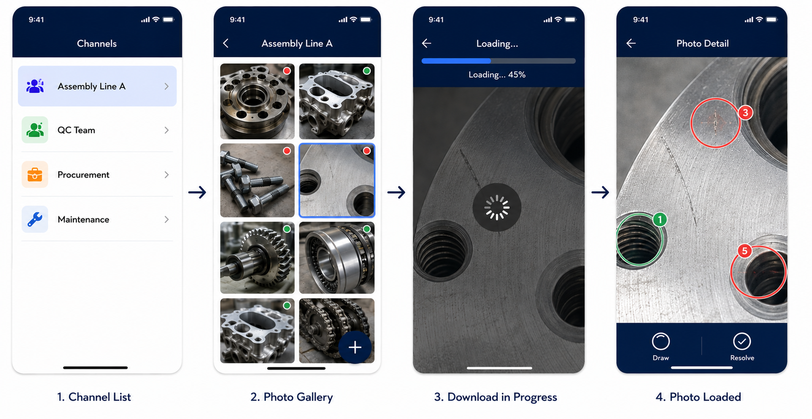
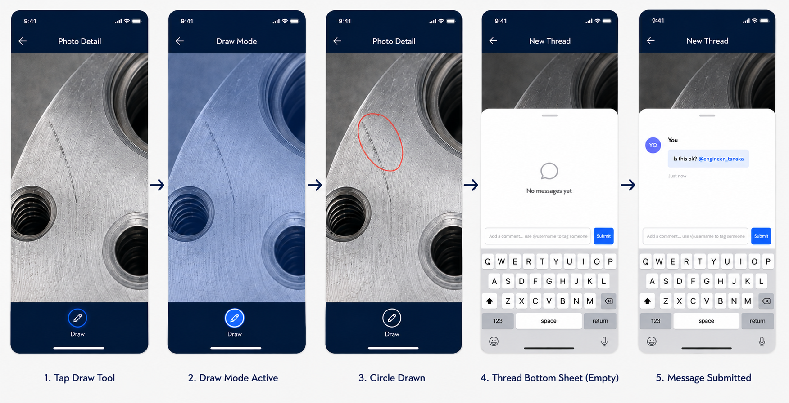
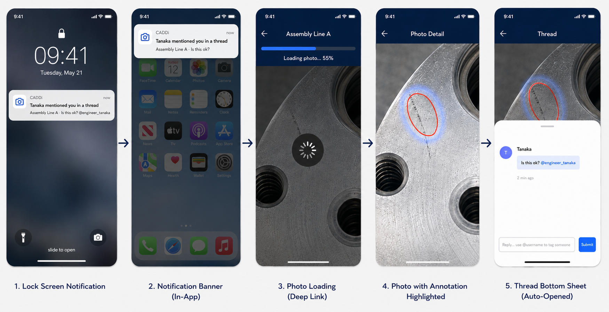
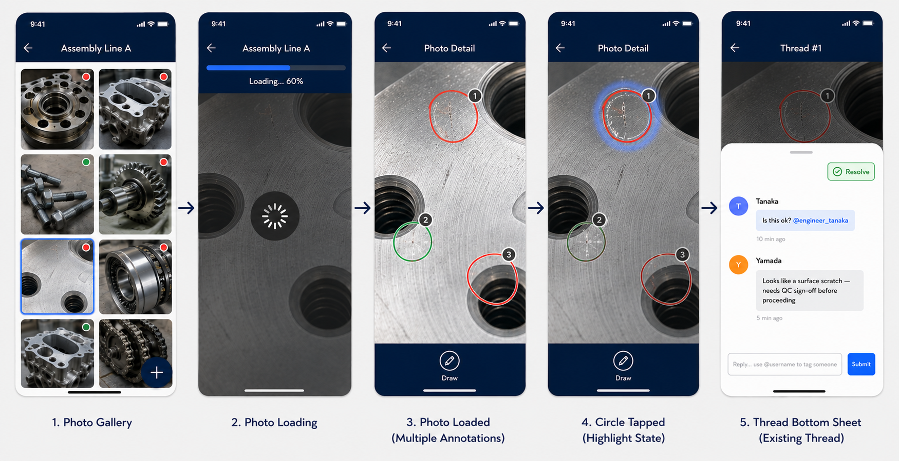

# CADDi Photo Annotation Service — User Flows

## Context & Assumptions

- **Platform:** Mobile only
- **Users:** Factory workers and Engineers (symmetric permissions — anyone can upload, draw, annotate, and reply)
- **Channels:** Pre-existing namespaces owned by a team. Created and managed by an org admin (out of scope for these flows).
- **Auth:** Pre-existing — users are already authenticated before entering any flow.

---

## Scenario 1 — Upload Photo



**Actor:** Factory worker or Engineer

1. User selects a channel
2. App shows the **Photo Gallery** (→ see S8) — existing photos sorted by latest activity, each with a status dot
3. User taps the **"Add"** button
4. User captures a new photo or picks one from the device gallery
5. Client compresses / resizes the photo before upload
6. Photo streams to server — a progress bar is shown
7. On upload complete, the photo opens with the annotation toolbar visible

---

## Scenario 2 — Load Photo



**Actor:** Factory worker or Engineer

1. User selects a channel
2. App shows the **Photo Gallery** (→ see S8) — existing photos sorted by latest activity, each with a status dot
3. User taps an existing photo card
4. Photo streams from server — a progress bar is shown
5. On load complete, all existing annotation circles render on top of the photo

> **Note:** S1 and S2 share the same entry point — the Photo Gallery (S8). The difference is whether the user taps "Add" (S1) or an existing photo (S2).

---

## Scenario 3 — Add New Annotation



**Actor:** Factory worker or Engineer  
**Precondition:** User has completed S1 or S2

1. User taps the **draw tool** button — app enters **draw mode** (locked; no other gestures active)
2. User draws a circle on the photo with their finger
3. App exits draw mode; the circle is placed on the photo
4. A **bottom sheet pushes up (80% screen height)** showing an empty thread
5. User types a message — may tag others using **@username**
6. User taps **"Submit"**
7. Any tagged user receives a **push notification** about the new thread (→ see S4)

---

## Scenario 4 — Receive & Open Notification



**Actor:** Tagged user (Factory worker or Engineer)  
**Precondition:** User was @mentioned in a thread (S3 or S5)

1. User receives a push notification: _"[Name] mentioned you in a thread"_
2. User taps the notification
3. App **deep-links** directly to the relevant photo
4. The specific annotation circle's thread bottom sheet opens automatically
5. User can read the thread and reply (→ see S5)

---

## Scenario 5 — Select Existing Annotation



**Actor:** Factory worker or Engineer  
**Precondition:** User has completed S2 and the photo has at least one annotation circle

1. User taps an existing circle on the photo
2. A **bottom sheet pushes up (80% screen height)** showing the full thread history for that circle
3. User reads existing messages
4. User may type a reply — may tag others using **@username**
5. User taps **"Submit"**
6. Any tagged user receives a push notification (→ see S4)

---

## Scenario 6 — Resolve Annotation

**Actor:** Factory worker or Engineer  
**Precondition:** User is viewing a thread via S3 or S5

1. User taps the **"Resolve"** button inside the thread bottom sheet
2. The annotation circle changes to **green** on the photo
3. The thread is marked as resolved (read-only / no further replies)
4. If **all** annotation circles on the photo are now resolved, the photo card updates to show a **green dot** in the Photo Gallery (→ see S8)

---

## Scenario 7 — Photo Gallery

**Actor:** Factory worker or Engineer  
**Precondition:** User has selected a channel

> This is the shared entry point for both S1 and S2.

1. App displays a **grid of photo thumbnails** sorted by **latest activity** (most recently uploaded or replied to, first)
2. Each photo card shows a **status dot** on its top-right corner:
   - 🔴 **Red dot** — at least one annotation thread is still unresolved
   - 🟢 **Green dot** — all annotation threads are resolved
   - _(No dot)_ — photo has no annotations yet
3. Two possible actions from this screen:
   - User taps **"Add"** button → continues into **S1 (Upload Photo)**
   - User taps an existing photo card → continues into **S2 (Load Photo)**

---

## Flow Relationships

```
Channel List
    └── Photo Gallery (S8) ◄─────────────────── dot updates from S6
            ├── [tap "Add"] Upload Photo (S1)
            │       └── Draw Mode (S7)
            │               └── Add New Annotation (S3)
            │                       ├── Resolve Annotation (S6) ──→ updates S8 dot
            │                       └── @mention ──→ Notification (S4)
            │
            └── [tap photo] Load Photo (S2)
                    ├── Select Existing Annotation (S5)
                    │       ├── Resolve Annotation (S6) ──→ updates S8 dot
                    │       └── @mention ──→ Notification (S4)
                    └── Draw Mode (S7)
                            └── Add New Annotation (S3)
                                    ├── Resolve Annotation (S6) ──→ updates S8 dot
                                    └── @mention ──→ Notification (S4)

Notification (S4) ──→ deep-link ──→ Photo + specific thread bottom sheet
```
